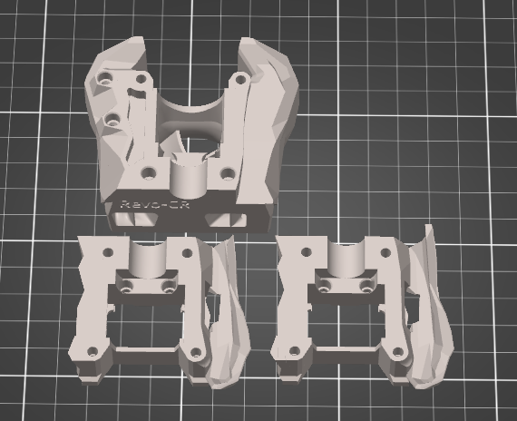
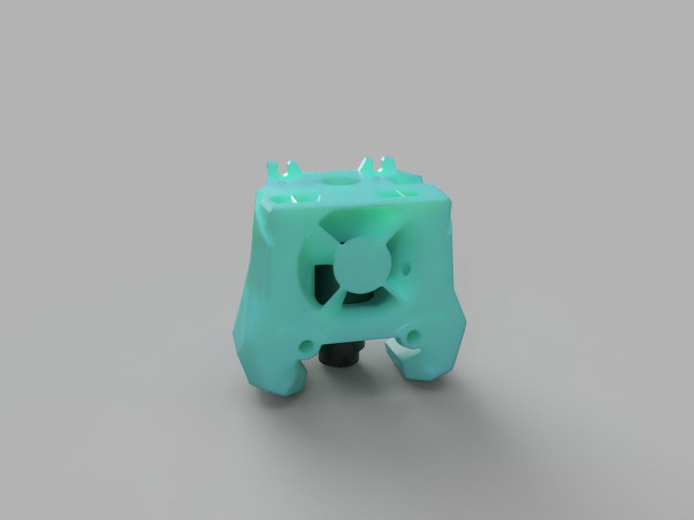

# stealthburner_revo-cr
 Revo CR toolhead for stealthburner

STLs are in the MESH folder.

I've had two users test this and say it's working fine for them. YMMV, create an issue on this github if you have problems

